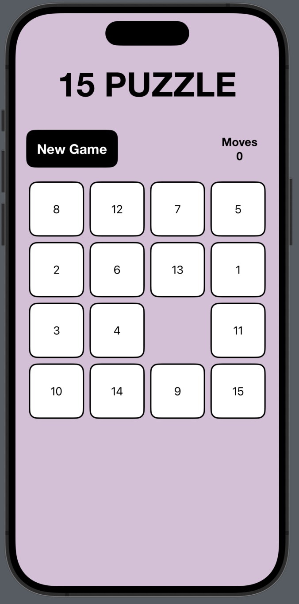
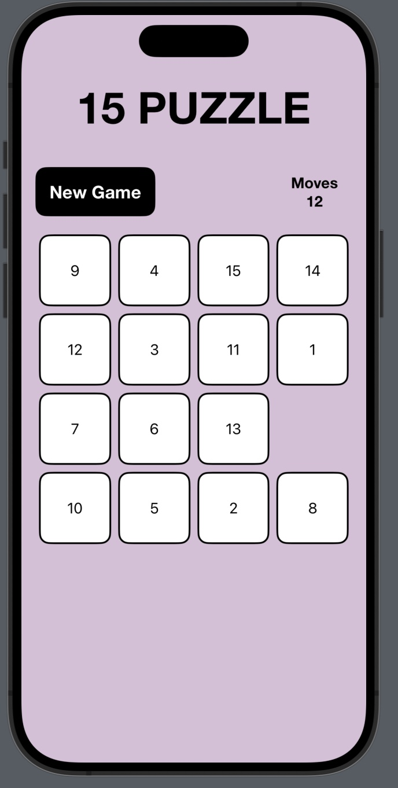
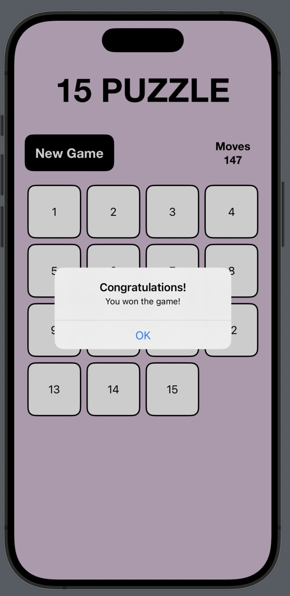
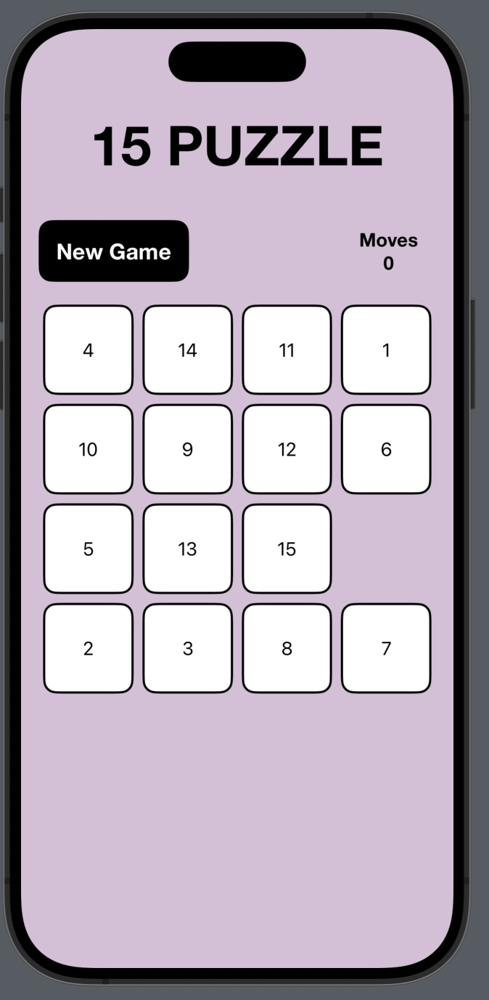

# CN436-AS2
6410615030 Natiphon Chanphet
[Demo Clip](https://youtu.be/Go49A5Fi0MM)

# Slide Number Puzzle
## About the Game
This game is called Puzzle 15, where the player is presented with a grid of numbered tiles with one tile missing. The objective of the game is to rearrange the tiles by sliding them into the empty space until they are arranged in numerical order from 1 to 15, with the empty space in the bottom right corner. The game continues until the player successfully solves the puzzle.

### How to play

* The game will initially display a scrumbled grid of numbered tiles.

* The player can slide the tiles horizontally or vertically to move them into the empty space and rearrange them. Each move will be counted and shown on the screen.

* When the player successfully arranges all the tiles in numerical order from 1 to 15, with the empty space in the bottom right corner, the game is won. It will display a message congratulating the player on their victory. After clicking OK, the game will restart.

* The player can click the "New Game" button to restart the puzzle and start again. The tiles will be shuffled, and the total number of moves will reset to 0.

